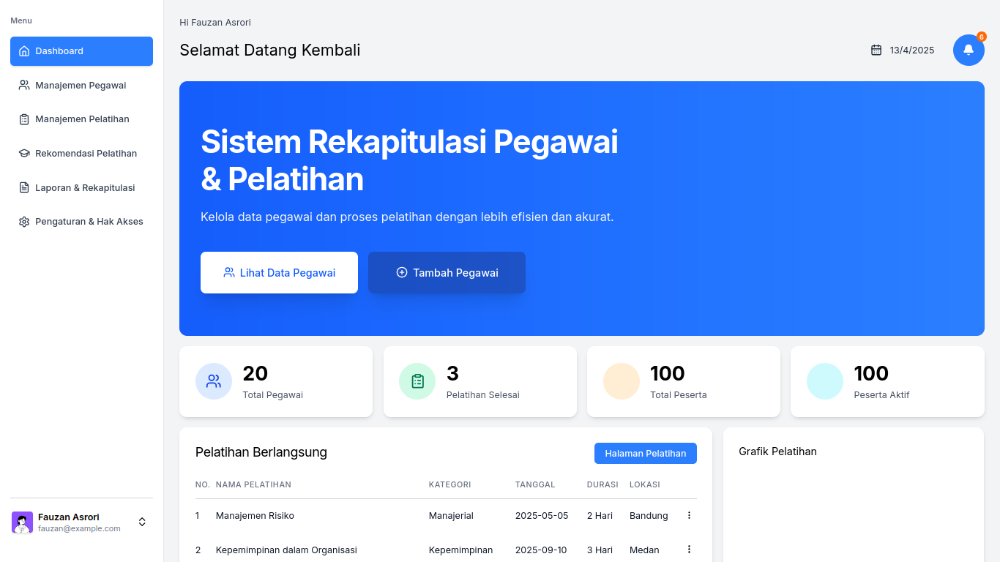

# 📊 Sistem Rekapitulasi Pegawai & Pemilihan Pelatihan

Sistem berbasis web untuk membantu Inspektorat Daerah Kabupaten Pati dalam merekap data pegawai serta mempermudah proses pemilihan pelatihan berdasarkan kebutuhan dan kriteria yang ditentukan.

---

## 🚀 Fitur Utama

- 📋 Rekapitulasi data pegawai
- 🧠 Penilaian kebutuhan pelatihan per pegawai
- 🗂️ Pemilihan jenis pelatihan berdasarkan kriteria tertentu
- 📅 Manajemen jadwal pelatihan
- 🔐 Login untuk admin dan pengguna internal

---

## 🛠️ Teknologi yang Digunakan

| Teknologi           | Keterangan                             |
| ------------------- | -------------------------------------- |
| Next.js             | Framework utama frontend               |
| Tailwind CSS        | Styling modern & responsive            |
| PostgreSQL          | Basis data utama                       |
| Supabase (opsional) | Jika digunakan untuk auth atau storage |
| Vercel / Netlify    | Untuk hosting (jika online)            |

---

## 📸 Cuplikan Tampilan (Screenshots)

> _(Tambahkan gambar hasil tampilan di folder `public/assets/` lalu tampilkan di sini)_

### Dashboard



---

## ⚙️ Cara Menjalankan Project

1. Clone repo ini:

```bash
git clone https://github.com/fauzanasrori/inspektorat-app.git
cd inspektorat-app
```

2. Install dependencies:

```bash
pnpm install
```

3. Jalankan project:

```bash
pnpm run dev
```

4. Buka di browser:

```
http://localhost:3000
```

---

## 🔐 Catatan Akses

- Role Admin: Akses penuh ke data & fitur
- Role User: Akses terbatas untuk pengisian form & melihat hasil

---

## 👨‍💻 Pengembang

Proyek ini dikembangkan sebagai bagian dari kegiatan PKL (Praktek Kerja Lapangan)  
oleh **Moh Fauzan Asrori**, mahasiswa aktif dengan minat di bidang sistem informasi & pengembangan web modern.

- 📧 Email: m45120121@email.com
- 📱 WhatsApp: +6288980798945

---

## 📄 Lisensi

Proyek ini dibuat untuk kebutuhan internal Inspektorat dan tidak untuk distribusi publik. Untuk penggunaan atau pengembangan lebih lanjut, silakan hubungi pengembang.
