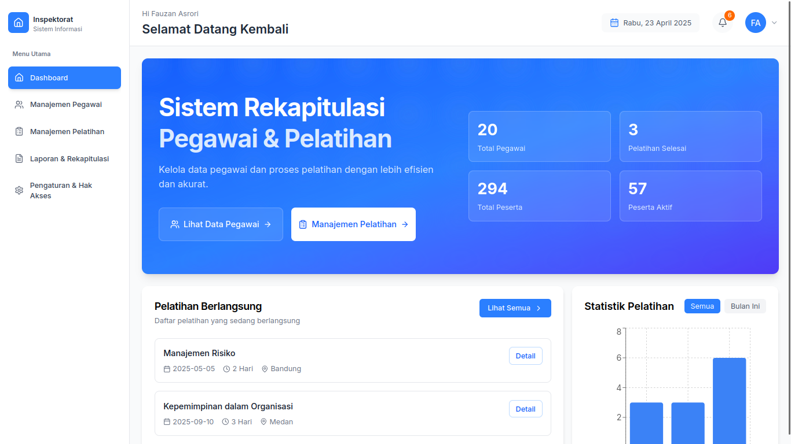

# 📊 Sistem Rekapitulasi Pegawai & Pemilihan Pelatihan

Sistem berbasis web untuk membantu Inspektorat Daerah Kabupaten Pati dalam merekap data pegawai serta mempermudah proses pemilihan pelatihan berdasarkan kebutuhan dan kriteria yang ditentukan.

> _⚠️ **Catatan**: Saat ini aplikasi hanya menggunakan data statik. Belum ada koneksi ke basis data atau fitur autentikasi. Halaman login juga belum tersedia dan akan dikembangkan di tahap selanjutnya._

---

## 🚀 Fitur Utama

- 📋 Rekapitulasi data pegawai (statik)
- 🧠 Penilaian kebutuhan pelatihan per pegawai
- 🗂️ Pemilihan jenis pelatihan berdasarkan kriteria tertentu
- 📅 Manajemen jadwal pelatihan

---

## 🛠️ Teknologi yang Digunakan

| Teknologi           | Keterangan                                  |
| ------------------- | ------------------------------------------- |
| Next.js             | Framework utama frontend                    |
| Tailwind CSS        | Styling modern & responsive                 |
| PostgreSQL          | Direncanakan untuk versi dinamis            |
| Supabase (opsional) | Untuk pengelolaan data & auth (belum aktif) |
| Vercel / Netlify    | Untuk hosting (jika online)                 |

---

## 📸 Cuplikan Tampilan (Screenshots)

### Dashboard



---

## ⚙️ Cara Menjalankan Project

1. Clone repo ini:

```bash
git clone https://github.com/fauzanasrori/inspektorat-app.git
cd inspektorat-app
```

2. Install dependencies:

```bash
pnpm install
```

3. Jalankan project:

```bash
pnpm run dev
```

4. Buka di browser:

```
http://localhost:3000
```

---

## 🔐 Catatan Akses

> _Saat ini belum tersedia sistem login maupun peran pengguna. Semua konten bersifat terbuka dan statik. Fitur ini akan ditambahkan di versi selanjutnya._

---

## 👨‍💻 Pengembang

Proyek ini dikembangkan sebagai bagian dari kegiatan PKL (Praktek Kerja Lapangan)  
oleh **Moh Fauzan Asrori**, mahasiswa aktif dengan minat di bidang sistem informasi & pengembangan web modern.

- 📧 Email: m45120121@email.com
- 📱 WhatsApp: +6288980798945

---

## 📄 Lisensi

Proyek ini menggunakan lisensi [MIT License](LICENSE).  
Silakan digunakan, dimodifikasi, dan disebarluaskan dengan mencantumkan atribusi yang sesuai.
