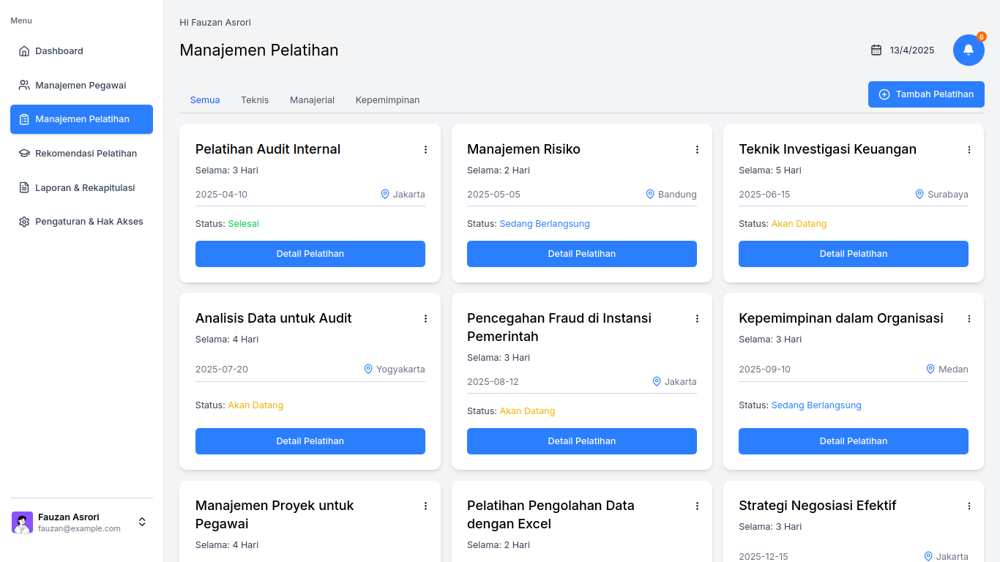

# 📊 Sistem Rekapitulasi Pegawai & Pemilihan Pelatihan

Sistem berbasis web untuk membantu Inspektorat Daerah Kabupaten Pati dalam merekap data pegawai serta mempermudah proses pemilihan pelatihan berdasarkan kebutuhan dan kriteria yang ditentukan.

---

## 🚀 Fitur Utama

- 📋 Rekapitulasi data pegawai
- 🧠 Penilaian kebutuhan pelatihan per pegawai
- 🗂️ Pemilihan jenis pelatihan berdasarkan kriteria tertentu
- 📅 Manajemen jadwal pelatihan
- 🔐 Login untuk admin dan pengguna internal

---

## 🛠️ Teknologi yang Digunakan

| Teknologi           | Keterangan                             |
| ------------------- | -------------------------------------- |
| Next.js             | Framework utama frontend               |
| Tailwind CSS        | Styling modern & responsive            |
| PostgreSQL          | Basis data utama                       |
| Supabase (opsional) | Jika digunakan untuk auth atau storage |
| Vercel / Netlify    | Untuk hosting (jika online)            |

---

## 📸 Cuplikan Tampilan (Screenshots)

> _(Tambahkan gambar hasil tampilan di folder `assets/` lalu tampilkan di sini)_




---

## ⚙️ Cara Menjalankan Project

1. Clone repo ini:

````bash
git clone git@github.com:fauzanasrori/inspektorat-app.git
cd inspektorat-app


This is a [Next.js](https://nextjs.org) project bootstrapped with [`create-next-app`](https://github.com/vercel/next.js/tree/canary/packages/create-next-app).

## Getting Started

First, run the development server:

```bash
npm run dev
# or
yarn dev
# or
pnpm dev
# or
bun dev
````

Open [http://localhost:3000](http://localhost:3000) with your browser to see the result.

You can start editing the page by modifying `app/page.js`. The page auto-updates as you edit the file.

This project uses [`next/font`](https://nextjs.org/docs/app/building-your-application/optimizing/fonts) to automatically optimize and load [Geist](https://vercel.com/font), a new font family for Vercel.

## Learn More

To learn more about Next.js, take a look at the following resources:

- [Next.js Documentation](https://nextjs.org/docs) - learn about Next.js features and API.
- [Learn Next.js](https://nextjs.org/learn) - an interactive Next.js tutorial.

You can check out [the Next.js GitHub repository](https://github.com/vercel/next.js) - your feedback and contributions are welcome!

## Deploy on Vercel

The easiest way to deploy your Next.js app is to use the [Vercel Platform](https://vercel.com/new?utm_medium=default-template&filter=next.js&utm_source=create-next-app&utm_campaign=create-next-app-readme) from the creators of Next.js.

Check out our [Next.js deployment documentation](https://nextjs.org/docs/app/building-your-application/deploying) for more details.
